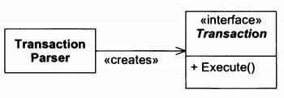

# payroll-system
An architectural design showcase. Based on Robert C. Martin's book "Agile Software Development"

## Specification
This system consists of a database of employees in the company and their associated data, such as time cards. The system must pay each employee. Employees must be paid the correct amount, on time, by the method that they specify. Also, various deductions must be takes from their pay.

- Some employees work by the hour. They are paid an hourly rate that is one of the fields in their employee record. They submit daily time cards that record the date and the number of hours worked. If they work more than 8 hours per day, they are paid 1.5 times their normal rate for those extra hours. They are paid every Friday.
- Some employees are paid a flat salary. They are paid on the last working day of the month. Their monthly salary is one of the fields in their employee record.
- Some of the salaried employees are also paid a commission based on their sales. They submit sales receipts that record the date and the amount of the sale. Their commission rate is a field in their employee record. They are paid every other Friday. Employees can select their method of payment. They may have their paychecks mailed to the postal address of their choice; they may have their paychecks help for pickup by the Paymaster; or they can request that their paychecks be directly deposited into the bank account of their choice.
- Some employees belong to the union. Their employee record has a field for the weekly dues rate. Their dues must be deducted from their pay. Also, the union may assess service charges agains individual union members from time to time. These service charges are submitted by the union on a weekly basis and must be deducted from the appropriate employee's next pay amount.
- The payroll application will run once each working day and pay the appropriate employees on that day. The system will be told to what date the employees are to be paid, so it will calculate payments from the last time the employee was paid up to the specified date.

## Patterns:
- `Transaction` is a **Command**

-`PayrollDatabase` is a **Facade** and a **Singleton**

-`AddEmployeeTransaction::execute()`, `ECT::invoke()` are **Template Methods**

-`NoAffiliation` is a **NullObject**